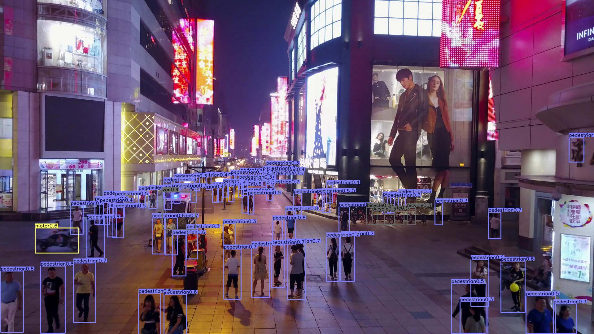
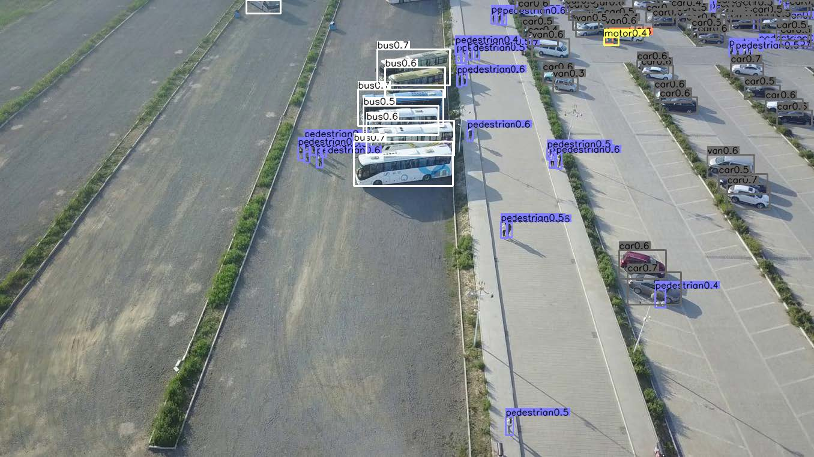

# Objects as Points
Object detection, 3D detection, and pose estimation using center point detection:

> [**Objects as Points**](http://arxiv.org/abs/1904.07850),            
> Xingyi Zhou, Dequan Wang, Philipp Krähenbühl,        
> *arXiv technical report ([arXiv 1904.07850](http://arxiv.org/abs/1904.07850))*         

Contact: [zhouxy@cs.utexas.edu](mailto:zhouxy@cs.utexas.edu). Any questions or discussions are welcomed! 

## Abstract 

Detection identifies objects as axis-aligned boxes in an image. Most successful object detectors enumerate a nearly exhaustive list of potential object locations and classify each. This is wasteful, inefficient, and requires additional post-processing. In this paper, we take a different approach. We model an object as a single point -- the center point of its bounding box. Our detector uses keypoint estimation to find center points and regresses to all other object properties, such as size, 3D location, orientation, and even pose. Our center point based approach, CenterNet, is end-to-end differentiable, simpler, faster, and more accurate than corresponding bounding box based detectors. CenterNet achieves the best speed-accuracy trade-off on the MS COCO dataset, with 28.1% AP at 142 FPS, 37.4% AP at 52 FPS, and 45.1% AP with multi-scale testing at 1.4 FPS. We use the same approach to estimate 3D bounding box in the KITTI benchmark and human pose on the COCO keypoint dataset. Our method performs competitively with sophisticated multi-stage methods and runs in real-time.

## Highlights

- **Simple:** One-sentence method summary: use keypoint detection technic to detect the bounding box center point and regress to all other object properties like bounding box size, 3d information, and pose.

- **Versatile:** The same framework works for object detection, 3d bounding box estimation, and multi-person pose estimation with minor modification.

- **Fast:** The whole process in a single network feedforward. No NMS post processing is needed. Our DLA-34 model runs at *52* FPS with *37.4* COCO AP.

- **Strong**: Our best single model achieves *45.1*AP on COCO test-dev.

- **Easy to use:** We provide user friendly testing API and webcam demos.

## A Method for Performance Improvement of Imbalance UAV Dataset-Based on Object Detection (proposed method)

### Introduction

Object detection has become very popular in recent year, one of the popular implementation is detection on Unmanned Aerial Vehicle (UAV) or drone. Examples of implementing the detection object on drones are aerial mapping, and infrastructure inspection. However, the application of object detection on drones has several
challenges, namely the presence of noise, blurring, low resolution, and the size of the detection target is quite small. Another thing that becomes an obstacle in object detection is the class imbalance. These problems will affect the results of the model’s performance if it is not handled properly.
In this final project, modification of the hyperparameters contained in the focal loss is carried out to overcome the class imbalance. The network architecture used
for object detection is CenterNet with Deep Aggregation layer as the backbone. The performance parameter measured in this final project is mean Average Precision.
The results of the study show that modifying the hyperparameters on the focal loss can improve the performance of the model. The highest mAP value was obtained
at 23.1% by using flip augmentation at the time of testing the data. If you do not use flip augmentation, the mAP value obtained is 22.4%. The modified CenterNet network architecture was also compared with several other architectures trained using the VisDrone-2019 dataset.

### Main results

#### Object Detection on VisDrone dataset

| a | b | AP / FPS| Flip AP / FPS | MultiScale AP / FPS |
|---|---|---------|---------------|---------------------|
| 0 | 0 | 18,1/25 | 18,9/13,8     | 17.8/5              |
| 0 | 2 | 22,4/25 | 23,0/13,8     | 21,8/5              |
| 0 | 4 | 21,1/25 | 21,6/13,8     | 20,7/5              |
| 2 | 0 | 15,3/25 | 15,9/13,8     | 15,0/5              |
| 2 | 2 | 22,4/25 | 23,1/13,8     | 22,1/5              |
| 2 | 4 | 19,3/25 | 20,2/13,8     | 19,6/5              |
| 4 | 0 | 18,5/25 | 19,3/13,8     | 17,7/5              |
| 4 | 2 | 20,2/25 | 20,9/13,8     | 20,6/5              |
| 4 | 4 | 22,0/25 | 22,5/13,8     | 22,1/5              |

All models and details are available in [Model zoo](readme/MODEL_ZOO.md).

## License

CenterNet itself is released under the MIT License (refer to the LICENSE file for details).
Portions of the code are borrowed from [human-pose-estimation.pytorch](https://github.com/Microsoft/human-pose-estimation.pytorch) (image transform, resnet), [CornerNet](https://github.com/princeton-vl/CornerNet) (hourglassnet, loss functions), [dla](https://github.com/ucbdrive/dla) (DLA network), [DCNv2](https://github.com/CharlesShang/DCNv2)(deformable convolutions), [tf-faster-rcnn](https://github.com/endernewton/tf-faster-rcnn)(Pascal VOC evaluation) and [kitti_eval](https://github.com/prclibo/kitti_eval) (KITTI dataset evaluation). Please refer to the original License of these projects (See [NOTICE](NOTICE)).

## Citation

If you find this project useful for your research, please use the following BibTeX entry.

    @inproceedings{zhou2019objects,
      title={Objects as Points},
      author={Zhou, Xingyi and Wang, Dequan and Kr{\"a}henb{\"u}hl, Philipp},
      booktitle={arXiv preprint arXiv:1904.07850},
      year={2019}
    }
